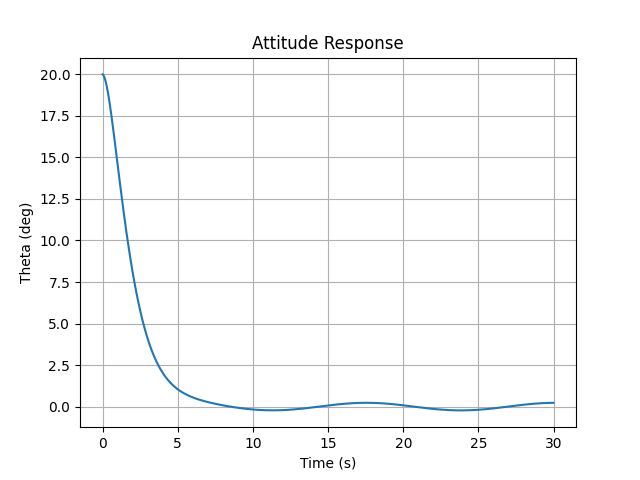
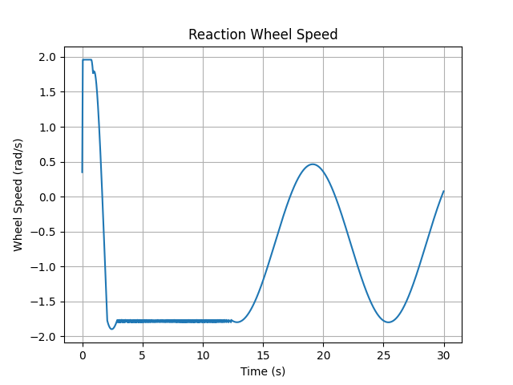
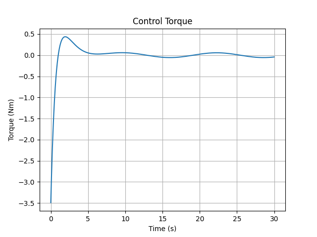

# 🛰️ Satellite Attitude Control Simulator

A Python-based spacecraft attitude dynamics and control simulator featuring:

- 🎯 PD Attitude Control
- ⚙️ Reaction Wheel Dynamics
- 🚀 Disturbance Rejection
- 🔄 Momentum Dumping
- 📊 Performance Analysis
- 📈 Automatic Result Generation

---

## 🌌 Project Overview

This project simulates the rotational motion of a spacecraft and demonstrates how attitude control systems maintain desired orientation in the presence of disturbances.

The simulator includes realistic spacecraft control concepts such as reaction wheel actuation, actuator saturation, momentum management, and disturbance rejection.

---

## ✨ Key Features

### 🎯 Attitude Control

- PD Controller Implementation
- Attitude Error Correction
- Angular Velocity Damping

### ⚙️ Reaction Wheel System

- Reaction Wheel Dynamics
- Wheel Speed Monitoring
- Wheel Saturation Modeling

### 🔄 Momentum Management

- Momentum Storage
- Momentum Dumping Logic
- Saturation Prevention

### 🚀 Disturbance Rejection

- External Disturbance Torque
- Controller Compensation
- Stability Analysis

### 📊 Performance Metrics

- Peak Time
- Peak Value
- Percent Overshoot
- Rise Time
- Settling Time

---

## 🧠 Mathematical Model

### Satellite Dynamics

`I_sat × dω/dt = T_control + T_disturbance`

### PD Controller

`T = -Kpθ - Kdω`

### Reaction Wheel Dynamics

`I_rw × dω_rw/dt = -T_control`

---

## 📂 Project Structure

```text
Satellite-Attitude-Control-Simulator/

├── main.py
├── satellite.py
├── controller.py
├── reaction_wheel.py
├── disturbances.py
├── performance_metrics.py
├── visualization.py
│
├── results/
│   ├── attitude_response.png
│   ├── wheel_speed.png
│   └── control_torque.png
│
├── README.md
└── requirements.txt
```

---

## 📈 Simulation Results

### Attitude Response



---

### Reaction Wheel Speed



---

### Control Torque



---

## ⚡ How to Run

### Install Dependencies

```bash
pip install -r requirements.txt
```

### Run Simulator

```bash
python main.py
```

---

## 🔮 Future Improvements

- 3-Axis Attitude Dynamics
- Quaternion-Based Full Attitude Propagation
- Magnetorquer Modeling
- Star Tracker Sensor Model
- Gyroscope Sensor Model
- Extended Kalman Filter (EKF)
- LQR / MPC Controllers
- Complete Spacecraft ADCS Architecture

---

## 🛠️ Technologies Used

- Python
- NumPy
- Matplotlib

---

## 👩‍💻 Author

**Reena Meena**

Mechanical Engineering Student  
Interested in Space Systems, Control Engineering, and Computational Simulation 🚀
